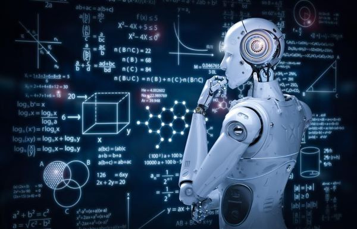

# ML_From_Scratch (ML Algorithms From Scratch)
This repo contains my implementation of Machine Learning Algorithms From Scratch.

=> All these algorithms, I have learn it during **self-learn** or **my university**.

=> For each Algorithm in this repo, **this is an example using the implemented algorithm**.

-------------

## Supervised Learning :

| # | Algorithm Name | Source |
|:---:|:--------------------------:|:-----------:|
| 01 | Random Forest (RF) | [Source](https://github.com/drisskhattabi6/ML_From_Scratch/tree/main/Random%20Forest%20from%20scratch) |
| 02 | Artificial Neural Network (ANN) | [Source](https://github.com/drisskhattabi6/ML_From_Scratch/tree/main/ANN%20From%20Scratch) |
| 03 | Decision Tree (CART) | [Source](https://github.com/drisskhattabi6/ML_From_Scratch/tree/main/Decision%20Tree%20from%20scratch) |
| 04 | K-Nearest Neighbor (KNN) | [Source](https://github.com/drisskhattabi6/ML_From_Scratch/tree/main/KNN%20from%20Scratch) |

-------------

## UnSupervised Learning :

| # | Algorithm Name | Source |
|:---:|:--------------------------:|:-----------:|
| 01 | K-Means | [Source](https://github.com/drisskhattabi6/ML_From_Scratch/tree/main/K-Means%20Algorithm) |

-------------

## Reinforcement Learning :

| # | Algorithm Name | Source |
|:---:|:--------------------------:|:-----------:|

