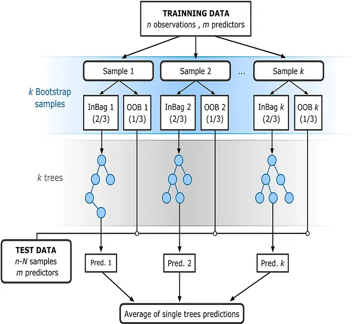

# Random Forest from scratch :

### This folder contains the Implementation of Random Forest Algorithm from Scratch with 4 example of using Random Forest :
- 2 for **Classification**, with 'Iris' dataset and 'Titanic' dataset.
- 2 for **Regression**, with 'Real estate' dataset and 'IceCreamData' dataset.

